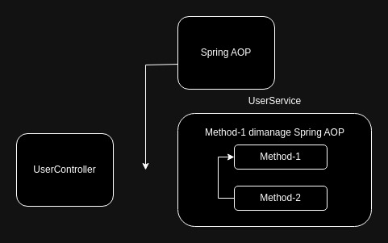

# Requirement
* Spring Framework/SpringBoot
* Spring Web Mvc
* Jdbc
* Bean Validation
* Jpa

# Spring Data JPA
Spring Data adalah adalah sebuah ekosistem di spring framework, yang tujuanya untuk mempermudah pegelolahan data di database.  
  
Ada banyak sekali ekosistem di spring data, misalnya :
* Spring Data JPA
* Spring Data LDAP
* Spring Data Redis
* Spring Data Elasticsearch
* Spring Data R2DBC
* dan masih banyak lagi

Untuk lebih detail nya bisa kunjungi disini https://spring.io/projects/spring-data/  
  
Penggunaan teknologi di ekosistem spring data cukup general, jadi sekali mempelajari salah satu ekosistem nya misalnya Spring data JPA maka saat kita ingin menggunakan ekosistem yang lain misalnya Spring Data Elasticsearch maka akan sangat mudah.  
Karena secara garis besar konsep dan penggunaanya sama.

Spring data JPA adalah sebuah bagian dari ekosistem Spring data project untuk mempermudah pengolahan data pada database menggunakan JPA. 
 
Dengan menggunakan Spring Data JPA Kita tidak perlu melakukan konfigurasi DataSource, JPA secara manual dan tentunya mempermudah untuk berkomunikasi dengan sistem basis data, untuk detail dari spring data jpa bisa kunjungi disini https://spring.io/projects/spring-data-jpa/

# Setup Project
Kalian bisa download spring project di https://start.spring.io/ dengan menambahkan dependency sebagai berikut :
* Spring Data Jpa
* JDBC
* Bean Validation
* Spring Web
* Lombok
* Mysql Driver
* SpringBoot dev tools

Untuk databasenya, disini saya akan mengunakan docker compose :  
``` yaml
version: '1.9'
services:
  mysql:
    image: mysql:latest
    ports:
      - 3306:3306
    environment:
      - MYSQL_ROOT_PASSWORD=secret_pass
    volumes:
      - mysql_volume:/var/lib/mysql
volumes:
  mysql_volume: {}
```

Untuk menjalankanya, jalankan perintah :
``` sh
docker compose -f docker-compose.yaml up -d
```
  
Membuat Database :
``` sh
docker exec -it spring-data-jpa-mysql-1 /bin/bash
```

``` sh
mysql -u root -p
```
setelah itu masukan password kalian (sesuai dengan password pada environtment di file docker-compose.yaml)  
``` sh
CREATE DATABASE spring_data_jpa;
```

# DataSorce config
Saat menggunakan SpringBoot atau Spring framework, kita tidak perlu lagi melakukan konfigurasi DataSource secara manual, misalnya :
* membuat class connection untuk membuat koneksi
* membuat persistance.xml untuk melakukan konfigurasi jpa
* menginstansiasi EntityManagerFactory
* dan sebagainya

By default sudah dikonfigurasikan oleh spring famework menggunakan class [`DataSourceAutoConfiguration`](https://docs.spring.io/spring-boot/docs/current/api/org/springframework/boot/autoconfigure/jdbc/DataSourceAutoConfiguration.html), dan untuk melakukan konfigurasi database kita bisa menggunakan `application.properties` atau `application.yaml` saja dengan prefix `spring.datasource`  
``` yaml
spring:
  datasource:
    # untuk menentukan driver yang digunakan
    driver-class-name: com.mysql.cj.jdbc.Driver
    username: root
    password: secret_pass
    url: jdbc:mysql://localhost:3306/spring_data_jpa
    # untuk menentukan database pooling yang digunakan
    type: com.zaxxer.hikari.HikariDataSource
    hikari:
      minimum-idle: 8
      maximum-pool-size: 15 
```
Untuk detail konfigurasinya bisa kunjungin disini https://docs.spring.io/spring-boot/docs/current/reference/html/application-properties.html#application-properties.data.spring.datasource.dbcp2


# Jpa Configuration
untuk melakukan konfigurasi JPA, misalnya menampilkan sql, format sql, dan sebagainya kita tidak perlu lagi menggunakan `persistence.xml`.  
Kita bisa menggunakan `application.properties` atau `application.yaml` untuk melakukan konfigurasi jpa nya dengan prefix `spring.jpa`

``` yaml
spring:
  datasource:
    # untuk menentukan driver yang digunakan
    driver-class-name: com.mysql.cj.jdbc.Driver
    username: root
    password: secret_pass
    url: jdbc:mysql://localhost:3306/spring_data_jpa
    # untuk menentukan database pooling yang digunakan
    type: com.zaxxer.hikari.HikariDataSource
    hikari:
      minimum-idle: 8
      maximum-pool-size: 15 
# Konfigurasi Jpa
  jpa:
    show-sql: true
    properties:
      '[format-sql]': true
```

# EntityManagerFactory
EntityManagerFactory adalah sebuah object yang digunakan untuk berinteraksi dengan database, misalnya untuk melakukan :
* CRUD
* TRANSACTION
* CRITERIA QUERY
* dan sebagainya

Saat kita menggunakan JPA secara manual maka kita akan melakukan konfigurasi EntityManagerFactory secara manual juga, namun ketika kita menggunakan Spring Data Jpa maka  tidak perlu lagi melakukan konfigurasi secara manual, karena semuanya telah otomatis dikonfigurasikan oleh spring data jpa dengan menggunakan [`JpaHibernateAutoConfiguration`](https://docs.spring.io/spring-boot/docs/current/api/org/springframework/boot/autoconfigure/orm/jpa/HibernateJpaAutoConfiguration.html)

``` java
@SpringBootTest(classes = SpringDataJpaApplication.class)
public class SpringDataJpaApplicationTests {

    /**
     * Jika kita membutuhkan EntityManagerFactory, disini kita bisa langsung
     * melakukan injection menggunakan @Autowired atau constructor injection dsb
     * karena EntityManagerFactory telah di buatkan dan di registrasikan sebagai
     * Spring Bean.
     * */
	private @Autowired EntityManagerFactory entityManagerFactory;

	@Test
	public void testEntityManager(){
		Assertions.assertNotNull(entityManagerFactory);
		EntityManager entityManager = this.entityManagerFactory.createEntityManager();
		Assertions.assertNotNull(entityManager);
		EntityTransaction transaction = entityManager.getTransaction();
		Assertions.assertNotNull(transaction);
		entityManager.close();
	}
}
```
# Repository
Saat menggunakan Spring Data JPA, kita akan jarang sekali menggunakan secara langsung `EntityManagerFactory` bahkan mungkin tidak akan pernah menggunakanya secara langsung.  
Lantas bagaimana cara kita berinteraksi dengan database ??  
Spring Data JPA menganut konsep DDD(Domain Driven Design) pada konsep DDD ini ketika kita ingin berinteraksi dengan database maka kita akan menggunakan layer Repository.  
  
Sebenarnya didalam layer Repository memuat EntityManager. Jadi layer repository ini hadir untuk mempermudah kita ketika berinteraksi dengan database, sehingga kita tidak perlu lagi memikirkan kekompleksitasan `EntityManagerFactory`  
  
Kode sebelum menggunakan Repository 
``` java
public void save(Payment payment) {
    EntityManager entityManager = this.entityManagerFactory.createEntityManager();
    EntityTransaction transaction = entityManager.getTransaction();
    transaction.begin();
    entityManager.persist(payment);
    transaction.commit();
}
```

kode setelah menggunakan repository :
``` java
public void save(Payment payment);
```

Untuk membuat Repository cukuplah mudah, cukup membuat interface yang mengextend salahsatu interface berikut :
* [JPaRepository\<E, ID>](https://docs.spring.io/spring-data/jpa/docs/current/api/org/springframework/data/jpa/repository/JpaRepository.html)
* [CrudRepository\<E, ID>](https://docs.spring.io/spring-data/commons/docs/current/api/org/springframework/data/repository/CrudRepository.html)
* [ListCrudRepository\<E, ID>](https://docs.spring.io/spring-data/commons/docs/current/api/org/springframework/data/repository/ListCrudRepository.html)
* [PagingAndSortingRepository\<E, ID>](https://docs.spring.io/spring-data/commons/docs/current/api/org/springframework/data/repository/PagingAndSortingRepository.htmlk)

Setelah itu kita bisa menambahkan annotation [@Repository](https://docs.spring.io/spring-framework/docs/current/javadoc-api/org/springframework/stereotype/Repository.html) pada interface nya.  
  
Sebelum kita membuat repository, pastikan kita telah memiliki Entity nya terlebih dahulu.  
Misalnya disini kita akan membuat `UserRepository` maka pastikan kita telah memiliki User entity.  
``` sql
CREATE TABLE users(
    id BIGINT NOT NULL AUTO_INCREMENT,
    username VARCHAR(100) NOT NULL,
    password VARCHAR(100) NOT NULL,
    PRIMARY KEY(id)
)ENGINE=InnoDb;
```

``` java
@Builder @Entity @Table(name = "users")
@Setter @Getter @AllArgsConstructor @NoArgsConstructor
public class User implements Serializable {

    @Id @GeneratedValue(strategy = GenerationType.IDENTITY)
    private Long id;

    @Column(name = "username", nullable = false)
    private String username;

    @Column(name = "password", nullable = false)
    private String password;
}
```

``` java
@Repository
public interface UserRepository extends JpaRepository<User, Long> { }
```
>**NOTE:** *Type Generic pada `JpaRepository` dan sebagainya adalah : E yang artinya **Entity** dan ID yang artinya **Id primarykey entity nya***

[`JpaRepository<E, ID>`](https://docs.spring.io/spring-data/jpa/docs/current/api/org/springframework/data/jpa/repository/JpaRepository.html) adalah interface turunan dari [`ListCrudRepository<E, ID>`](https://docs.spring.io/spring-data/commons/docs/current/api/org/springframework/data/repository/ListCrudRepository.html), [`PagingAndSortingRepository<E, ID>`](https://docs.spring.io/spring-data/commons/docs/current/api/org/springframework/data/repository/PagingAndSortingRepository.htmlk), Iterface tersebut memiliki banyak sekali method misalnya untuk operasi CRUD dan sebagainya.  
  
Ketika kita menggunakan layer Repository kita tidak perlu menggunakan `EtityManager` secara langsung untuk melakukan operasi CRUD, melainkan cukup menggunakan method yang disediakan oleh interface-interface Repository. Misalnya ketika kita ingin melakukan insert data, maka kita bisa menggunakan method `save(entity)`.  
  
> **NOTE:** *method `save(entity)` digunakan untuk insert dan update*
``` java
@SpringBootTest(classes = SpringDataJpaApplication.class)
public class UserRepositoryTest {
    
    /**
     * Disini kita bisa secara langsung menginject
     * UserRepository secara langsung, karena telah di registrasikan
     * menjadi spring bean,
     * 
     * jadi semua interface yang meng extend interface repository maka secara
     * otomatis dijadikan spring bean
     * */
    private @Autowired UserRepository userRepository;

    @Test
    public void testInsert(){
        User user = User.builder()
                    .username("Abdillah")
                    .password("secret_pass")
                    .build();
        // melakukan insert data
        this.userRepository.save(user);
    }
}
```

# Declarative Transaction
Ketika menggunakan JPA, saat kita ingin melakukan transaction maka kita akan melakukan seperti berikut ini :
``` java
EntityManager entityManager = this.entityManagerFactory.createEntityManager();
Transaction transaction = entityManager.getTransaction();
transaction.begin();
// operasi CRUD

transaction.commit();
```
Cara diatas adalah cara melakukan transaction secara manual, tentunya agak ribet karena kita harus menghandle secara manual unutk commit dan rollback nya.  
  
Saat kita menggunakan Spring Data JPA, jika kita ingin melakukan transaction kita tidak perlu lagi melakukan cara seperti itu. Spring Data JPA menyediakan annotation [`@Transactional`](https://docs.spring.io/spring-framework/docs/current/javadoc-api/org/springframework/transaction/annotation/Transactional.html) untuk melakukan transaction.  
  
Cara kerja Annotation `@Transactional` adalah menggunakan Spring AOP, jadi ketika method yang di annotation dengan `@Transactional` maka ketika method tersebut diakses dari object luar/Object lain maka transaction tersebut akan dijalankan(melakukan commit atau rollback secara otomatis)  


``` java
@Service @AllArgsConstructor
public class UserService {
    
    private final UserRepository userRepository;

    @Transactional
    public void create() {
        User user = User.builder()
                    .username("Abdillah")
                    .password("secret")
                    .build();

        User user1 = User.builder()
                    .username("Alli")
                    .password("secret")
                    .build();
        User user2 = User.builder()
                    .username("Nabila")
                    .password("secret")
                    .build();
        List<User> userList = new ArrayList<>(List.of(user, user1, user2));
        userList.forEach(u -> {
            this.userRepository.save(u);
        });
        throw new ResponseStatusException(HttpStatus.INTERNAL_SERVER_ERROR, "error");
    }
}
```

``` java
@SpringBootTest(classes = SpringDataJpaApplication.class)
public class UserServiceTest {
    
    private @Autowired UserService userService;

    @Test
    public void testIsert(){
        Assertions.assertThrows(ResponseStatusException.class, () -> {
            // akan melakukan rollback secara otomatis
            this.userService.create();
        });
    }
}
```
Perlu diketahui bahwa Spring AOP hanya bekerja ketika ada object luar yang mentriger obejct yang memiliki annotation yang dimanage AOP.  
  
jika Obejct yang dimanage oleh Spiring AOP diakses dengan method nya sendiri maka Spring AOP tidak akan bekerja. Hal tersebut berlaku juga ketika kita menggunakan annotation `@Transactional` karena annotation tersebut dimanage oleh Spirng AOP  

``` java
@Service @AllArgsConstructor
public class UserService {
    
    private final UserRepository userRepository;

    @Transactional
    public void create() {
        User user = User.builder()
                    .username("Abdillah")
                    .password("secret")
                    .build();

        User user1 = User.builder()
                    .username("Alli")
                    .password("secret")
                    .build();
        User user2 = User.builder()
                    .username("Nabila")
                    .password("secret")
                    .build();
        List<User> userList = new ArrayList<>(List.of(user, user1, user2));
        userList.forEach(u -> {
            this.userRepository.save(u);
        });

        throw new ResponseStatusException(HttpStatus.INTERNAL_SERVER_ERROR, "error");
    }

    // Ketika method ini memanggila method create(); maka transaction tidak akan dijalankan
    // karena annotation @Transaction hanya bekerja ketika method create() diakses oleh object lain(diakses oleh luar Object)
    public void call() {
        create();
    }
}
```

``` java
@SpringBootTest(classes = SpringDataJpaApplication.class)
public class UserServiceTest {
    
    private @Autowired UserService userService;

    @Test
    public void testInsertFail(){
        Assertions.assertThrows(ResponseStatusException.class, () -> {
          /**
           * ketika method call(); dipanggil
           * transaction tidak akan dijalankan
           * */
            this.userService.call();
        });
    }
}
```
  
Saat menggunakan annotation `@Transactional` kita bisa menambahkan beberapa pengaturan, misalnya :
| Pengaturan  | Default Value | Deskripsi
|-------------|---------------|---------------------
| readOnly    | false         | Jika transaction tidak mengubah data samasekali
| timeout     | -1            | Membatasi lama transaction
| propagation | REQUIRED      | Membuat transaction jika belum ada dan tidak membuat transaction jika sudah ada

dan masih banyak lagi, untuk lebih detailny abisa kunjungi disini https://docs.spring.io/spring-framework/docs/current/javadoc-api/org/springframework/transaction/annotation/Transactional.html

``` java
@Service @AllArgsConstructor
public class UserService {
    
    private final UserRepository userRepository;

    @Transactional(readOnly = true, propagation = Propagation.REQUIRED)
    public List<User> getUserts() {
        /**
        * ini tidak melakukan perubahan data sama sekali, maka kita busa gunakan
        * aturan readOnly = true
        *
        * Propagation.REQUIRED(default value)
        **/
        return this.userRepository.findAll();
    }
}
```

# Transaction Propagation
Sebelumnya kita telah menyinggung tentang pengaturan propagattion yang ada pada annotation `@Transactional`.  
Transaction propagation digunakan ketika transaction yang sedang berjalan mengakses transaction lain, misalnya ketika method transaction pada `UserService` memanggil method transaction pada `PaymentService`.  
Ada banyak sekali pengaturan yang bisa kita gunakan pada transaction propagation, diantaranya yaitu
| Propagation   | Deskripsi 
|---------------|-----------
| REQUIRED      | Membuat transaction jika transaction belum dibuat
| MANDATORY     | Transaction harus diakses oleh transaction lain
| NEVER         | Tidak melakukan transaction

Dan masih banyak lagi, untuk lebih detail nya bisa kunjungi disini https://docs.spring.io/spring-framework/docs/current/javadoc-api/org/springframework/transaction/annotation/Propagation.html


``` java
@Entity @Table(name = "payments")
@Setter @Getter @AllArgsConstructor @NoArgsConstructor @Builder
public class Payment implements Serializable {
    
    @Id @GeneratedValue(strategy = GenerationType.UUID)
    private String id;

    private String reciver;

    private Date date;

    private Double amount;
}
```

``` java
@Repository
public interface PaymentRepository extends JpaRepository<Payment, String> { }
```

``` java
@Builder
@Setter @Getter @AllArgsConstructor @NoArgsConstructor
public class PaymentRequest implements Serializable {
    
    private String id;

    private String reciver;

    private Double amount;
}
```

``` java
@Service @AllArgsConstructor
public class PaymentService {
    
    private final PaymentRepository paymentRepository;

    private final ObjectMapper objectMapper;
    
    @Transactional(propagation = Propagation.MANDATORY)
    public void tranfer(PaymentRequest request) throws JsonMappingException, JsonProcessingException {
        Payment payment = this.objectMapper.readValue(this.objectMapper.writeValueAsString(request), Payment.class);
        payment.setDate(new Date());
        this.paymentRepository.save(payment);
    }
}
```

``` java
@Service @AllArgsConstructor
public class UserService {
    
    private final UserRepository userRepository;

    private final PaymentService paymentService;

    @Transactional
    public void userTranfer(PaymentRequest request) throws JsonMappingException, JsonProcessingException {
        this.paymentService.tranfer(request);
    }
}
```

``` java
@SpringBootTest(classes = SpringDataJpaApplication.class)
public class UserServiceTest {
    
    private @Autowired UserService userService;

    private @Autowired PaymentService paymentService;

    @Test
    public void testPropagationSuccess() throws JsonMappingException, JsonProcessingException{
        PaymentRequest paymentRequest = PaymentRequest.builder()
                    .amount(10.0000d)
                    .reciver("Alli")
                    .build();
        Assertions.assertDoesNotThrow(() -> {
            this.userService.userTranfer(paymentRequest);
        });
    }

    @Test
    public void testFailPropagation() throws JsonMappingException, JsonProcessingException {
        Assertions.assertThrows(IllegalTransactionStateException.class, () -> {
            PaymentRequest paymentRequest = PaymentRequest.builder()
                            .reciver("Nero")
                            .amount(30.000d)
                            .build();
            this.paymentService.tranfer(paymentRequest);
        });
    }
}
```

# TransactionOperation
Kita telah mengetahui cara melakukan transaction denga cara Declatarive Transaction menggunakan annotation `@Transactional`, namun di case tertentu kita butuh melakukan transaction secara manual, misalnya ketika kode kita berjalan secara multi threding atau Asyncronus.  
  
Mungkin teman-teman berfikir *"Kalo gitu pake aja `EntityManager` terus pake method `getTransaction()` untuk dapetion object transaction.... nah abis itu pake transaction nya secara manual"*  
``` java
public void create() {
    EntityManager entityManager = this.entityManagerFactory.createEntityManager();
    Transaction transaction = entityManager.getTransaction();
    transaction.begin();
    // OPERASI CURD

    transaction.commit()
}
```
  
Hal tersebut dapat kita lakukan, namun daripada menggunakan cara manual seperti diatas lebih baik menggunakan cara prohrammatic denga menggunakan [`TransactionOperation`](https://docs.spring.io/spring-framework/docs/current/javadoc-api/org/springframework/transaction/support/TransactionOperations.html) atau [`TransactionTemplate`](https://docs.spring.io/spring-framework/docs/current/javadoc-api/org/springframework/transaction/support/TransactionTemplate.html) atau menggunakan cara yang low level dengan menggunakan [`PlatformTransactionManager`](https://docs.spring.io/spring-framework/docs/current/javadoc-api/org/springframework/transaction/PlatformTransactionManager.html). Kita bisa mengguankan nya langsung kedua object tersebut karena sudah Diregistrasikan sebagai Bean oleh Spring.  

Untuk melakukan transaction nya kita bisa menggunakan method `execute()` jika method mengembalikan result, namin jika mehtod tida megembalikan result maka bisa menggunakan method `executeWithoutResult()`.  
Untuk lebih detailnya bisa kunjungi disini https://docs.spring.io/spring-framework/docs/4.2.x/spring-framework-reference/html/transaction.html#transaction-programmatic
``` java
@Service @AllArgsConstructor
public class UserService {
    
    private final UserRepository userRepository;

    private final TransactionOperations transactionOperations;

    public void updateUser() {
        this.transactionOperations.executeWithoutResult(transaction -> {
            User user = this.userRepository.findById(12L).orElse(null);
            user.setUsername("AOWAOKWOAKWAOK");
            this.userRepository.save(user);
            throw new RuntimeException("Someting error");
        });
    }
}
```

``` java
@SpringBootTest(classes = SpringDataJpaApplication.class)
public class UserServiceTest {
    
    private @Autowired UserService userService;

    @Test
    public void programmaticTransactionTest(){
        Assertions.assertThrows(RuntimeException.class, () -> userService.updateUser());
    }
}
```
  
# PlatformTransactionManager
Jika kita ingin melakukan transaction secara low level, tidak disarankan menggunakan `EnitytManager` secara langsung, lebih baik menggunakan [`PlatformTransactionManager`](https://docs.spring.io/spring-framework/docs/current/javadoc-api/org/springframework/transaction/PlatformTransactionManager.html). Cara penggunaanya cukup mirip seperti menggunakan `EntityManager`.  
Kita bisa langsung menggunakan `PlatformTransactionManager` karena spring secara otomatis telah meregistrasikanya menjadi Spring Bean.
``` java
@Service @AllArgsConstructor
public class PaymentService {
    
    private final PaymentRepository paymentRepository;

    private final PlatformTransactionManager platformTransactionManager;

    public void manualTransaction() {
        // ini bisa kita asumsikan sebagai konfigurasi transaction
        DefaultTransactionDefinition definition = new DefaultTransactionDefinition();
        definition.setTimeout(5);
        definition.setReadOnly(false);
        definition.setPropagationBehavior(TransactionDefinition.PROPAGATION_REQUIRED);
        TransactionStatus transaction = this.platformTransactionManager.getTransaction(definition);

        try {
            Payment payment = Payment.builder()
                            .reciver("Abdillah")
                            .amount(40.000d)
                            .date(new Date())
                            .build();
            this.paymentRepository.save(payment);
            // disini terjadi throw error maka akan melakukan rollback
            error();
            this.platformTransactionManager.commit(transaction);
        } catch (Exception e) {
            this.platformTransactionManager.rollback(transaction);
        }
    }
    
    public void error() throws SQLException {
        throw new SQLException("Something error");
    }
}
```

``` java
@SpringBootTest(classes = SpringDataJpaApplication.class)
public class PaymetServiceTest {
    
    private @Autowired PaymentService paymentService;

    @Test
    public void testPlatformTransactionMaager(){
        this.paymentService.manualTransaction();
    }
}
```

# Query Method
Untuk melakukan Query biasanya kita akan menggunakan `EntityManager` dengan JPAQL
``` java
EntityManager entityManager = this.entityManagerFactory.createEntityManager();
Transaction transaction = entityManager.getTransaction();
transaction.begin();
Payment payment = this.objectManpper.readValue(this.objectMapper.writeValueAsString(paymentRequest), Payment.class);
// melakukan query insert
entityManager.persist(payment);
transaction.commit();
```

Namun, ketika kita menggunakan layer Repository kita tidak perlu melakukanya seperti contoh diatas. Spring Data Jpa memiliki fitur Query Method. Query Method pada Spring Data Jpa memungkinkan kita untuk membuat query berdasarkan nama method nya, misalnya `findById(id)`, `findByNameEquals(name)`, `findByUsernameNotLike(username)` dan sebagainya.  
  
Spring Data akan secara otomatis akan melakukan translet/menterjemahkan nama query method menjadi JPAQL. Untuk melakukan query menggunakan nama method ada beberapa aturan, misalnya ketika ingin menampilkan data pertama kita bisa menggunakan prefix `findFirstBy...`.  
Untuk lebih detail mengenai prefix, operator dan sebagainya tentang nama query method kita bisa kunjungi disini https://docs.spring.io/spring-data/jpa/reference/jpa/query-methods.html#jpa.query-methods.query-creation  

``` java
@Repository
public interface PaymentRepository extends JpaRepository<Payment, String> { 

    // menampilkan semua reciver berdasarkan nama reciver
    public Optional<Payment> findByReciver(String reciver);

    // menampilkan amound yang lebih besar
    public List<Payment> findByAmountGreaterThan(Double amount);

    // menampilkan data berdasarkan nama reciver dan diurutkan DESC
    public List<Payment> findAllByReciverOrderByDateDesc(String reciver);
}
```
``` java
@Service @AllArgsConstructor
public class PaymentService {
    
    private final PaymentRepository paymentRepository;

    @Transactional(readOnly = true)
    public List<Payment> findByreciver(String reciver) {
        return this.paymentRepository.findAllByReciverOrderByDateDesc(reciver);
    }
}
```
``` java
@SpringBootTest(classes = SpringDataJpaApplication.class)
public class PaymetServiceTest {
    
    private @Autowired PaymentService paymentService;

    private @Autowired PaymentRepository paymentRepository;

    @Test
    public void testFindReciver(){
        Payment payment1 = Payment.builder()
                    .reciver("Abdillah")
                    .amount(10.000d)
                    .date(new Date())
                    .build();
        Payment payment2 = Payment.builder()
                    .reciver("Asta")
                    .amount(10.000d)
                    .date(new Date())
                    .build();
        Payment payment3 = Payment.builder()
                    .reciver("Alli")
                    .amount(10.000d)
                    .date(new Date())
                    .build();
        this.paymentRepository.saveAll(List.of(payment1, payment2, payment3));

        List<Payment> reciver = this.paymentService.findByreciver("Abdillah");
        Assertions.assertTrue(!reciver.isEmpty());
    }
}
```
# Query Embeded Field
Kita telah mengetahui cara melakukan query menggunakan nama method pada layer repository. Namun pertanyaanya bagaimana jikalau kita
ingin melakukan query berdasarkan relasinya???  
Ketika kita menggunakan JPA atau query native kita bisa menggunakan tanda titik ( . ) untuk mengakses embeded field
``` sql
SELECT *  FROM users AS u INNER JOIN addresses AS a ON (u.address_id = a.id) WHERE a.country = "Indonesian";
```
> perhatikan setelah keyword WHERE, disitu terdapat `a.country` yang merupakan embeded field pada entity User


Saat kita menggunakan nama method untuk melakukan query nya kita tidak bisa menggunakan tanda titik ( . ) untuk melakukanya karena dalam standar penamaan method tidak boleh menggunakan titik, lantas gimana dong :v???  
  
Saat kita menggunakan method query dan kita ingin mengakses embeded fieldnya kita bisa menggunakan simbol underscore ( _ ).  
  
Untuk contohnya, mari kita buat tabel address dan kita berikan relasi pada table users.
``` sql
CREATE TABLE addresses(
    id BIGINT AUTO_INCREMENT,
    country VARCHAR(100) NOT NULL,
    province VARCHAR(100) NOT NULL,
    city VARCHAR(100) NOT NULL,
    postal_code VARCHAR(100) NOT NULL,
    PRIMARY KEY(id)
)Engine=InnoDB;
```

``` sql
ALTER TABLE users ADD column address_id BIGINT UNIQUE,
    ADD CONSTRAINT fk_address FOREIGN KEY(address_id) REFERENCES addresses(id);
```

Setelah itu, kita buat entity `Address` dan kita update entity `User`
``` java
@Builder @Entity @Table(name = "addresses")
@Setter @Getter @AllArgsConstructor @NoArgsConstructor
public class Address {
    
    @Id @GeneratedValue(strategy = GenerationType.IDENTITY)
    private Long id;

    @Column(length = 100, nullable = false)
    private String country;
    
    @Column(length = 100, nullable = false)
    private String province;
    
    @Column(length = 100, nullable = false)
    private String city;
    
    @Column(length = 100, nullable = false, name = "postal_code")
    private String postalCode;

    @OneToOne(mappedBy = "address")
    private User user;
}
```
``` java
@Builder @Entity @Table(name = "users")
@Setter @Getter @AllArgsConstructor @NoArgsConstructor
public class User implements Serializable {

    @Id @GeneratedValue(strategy = GenerationType.IDENTITY)
    private Long id;

    @Column(name = "username", nullable = false)
    private String username;

    @Column(name = "password", nullable = false)
    private String password;

    @OneToOne(fetch = FetchType.EAGER)
    private Address address;
}

```

Berikut ini contoh mengakses embeded field di layer repository menggunakan simbol underscore ( _ ) :
``` java
// select * from users as u left join addresses as a on (u.address_id = a.id) where a.country = ?
public List<User> findAllUserByAddress_CountryEquals(String country);

// Select * from users as u left join addresses as a on (u.address_id = a.id) where a.country = ? and a.city = ?;
public List<User> findAllUserByAddress_CountryEqualsAndAddress_CityEquals(String country, String city);

// select * from users as u left join addresses as a on (u.address_id = a.id) where a.province = ?
public Optional<User> findFirstUserByAddress_ProvinceEquals(String province);
```

``` java
@SpringBootTest(classes = SpringDataJpaApplication.class)
public class UserRepositoryTest {
    
    private @Autowired UserRepository userRepository;

    private @Autowired AddressRepository addressRepository;

    @BeforeEach
    public void setUp(){
        this.userRepository.deleteAll();
        this.addressRepository.deleteAll();;
        this.userRepository.deleteAll();
        Address address1 = Address.builder()
                    .country("Indonesian")
                    .city("Jakarta")
                    .province("DKI Jakarta")
                    .postalCode("94502")
                    .build();
        Address address2 = Address.builder()
                    .country("Indonesian")
                    .city("Jakarta")
                    .province("DKI Jakarta")
                    .postalCode("94502")
                    .build();
        Address address3 = Address.builder()
                    .country("Rusia")
                    .city("Moscow")
                    .province("Moscow")
                    .postalCode("3302")
                    .build();
        this.addressRepository.saveAll(List.of(address1, address2, address3));
        User user1 = User.builder()
                    .username("Abdillah")
                    .password("secret")
                    .address(address1)
                    .build();
        User user2 = User.builder()
                    .username("Azahra")
                    .password("secret")
                    .address(address2)
                    .build();
        User user3 = User.builder()
                    .username("Alli")
                    .password("secret")
                    .address(address3)
                    .build();
        this.userRepository.saveAll(List.of(user1, user2, user3));
    }

    @Test
    public void testEmbeded(){
        List<User> userByCountryAndAddress = this.userRepository.findAllUserByAddress_CountryEqualsAndAddress_CityEquals("Rusia", "Moscow");
        Assertions.assertTrue(!userByCountryAndAddress.isEmpty());
        Assertions.assertNotNull(userByCountryAndAddress);
    }
}
```

# Sort
Sebelumnya kita telah mengetahui cara melakukan pegurutan data `Order by` dengan menggunakan query method
```java
public List<Payment> findAllByReciverOrderByDateDesc(String reciver);

public List<Payment> findAllByReciverOrderByDateAsc(String reciver);
```
Selain menggunakan nama method seperti contoh diatas kita juga bisa menggunakan [`Sort`](https://docs.spring.io/spring-data/commons/docs/current/api/org/springframework/data/domain/Sort.html) pada parameter method query
``` java
public List<Payment> findAll(Sort sort);
```
``` java
@SpringBootTest(classes = SpringDataJpaApplication.class)
public class PaymetServiceTest {
    
    private @Autowired PaymentService paymentService;

    private @Autowired PaymentRepository paymentRepository;

    private final SimpleDateFormat simpleDateFormat = new SimpleDateFormat("dd-mm-yyyy");

    @BeforeEach
    public void setUp() throws ParseException{
        this.paymentRepository.deleteAll();

       
        Payment payment1 = Payment.builder()
                    .amount(10.000d)
                    .date(simpleDateFormat.parse("10-2-2024"))
                    .reciver("Abdillah")
                    .build();
        Payment payment2 = Payment.builder()
                    .amount(15.000d)
                    .date(simpleDateFormat.parse("2-5-2024"))
                    .reciver("Alli")
                    .build();
        Payment payment3 = Payment.builder()
                    .amount(16.000d)
                    .date(simpleDateFormat.parse("20-6-2025"))
                    .reciver("Alliano")
                    .build();
        Payment payment4 = Payment.builder()
                    .amount(30.000d)
                    .date(simpleDateFormat.parse("6-3-2023"))
                    .reciver("Allia")
                    .build();
        Payment payment5 = Payment.builder()
                    .amount(40.000d)
                    .date(simpleDateFormat.parse("11-2-2024"))
                    .reciver("Azahra")
                    .build();
        this.paymentRepository.saveAll(List.of(payment1, payment2, payment3, payment4, payment5));
    }

    @Test
    public void testSort(){
        Sort sort = Sort.by(Sort.Order.desc("date"));
        // select * from payments as p order by p.date desc;
        List<Payment> paymentList = this.paymentRepository.findAll(sort);
        Assertions.assertNotNull(!paymentList.isEmpty());
        Assertions.assertEquals("Alliano", paymentList.get(0).getReciver());
        Assertions.assertEquals("Azahra", paymentList.get(1).getReciver());
        Assertions.assertEquals("Abdillah", paymentList.get(2).getReciver());
    }
}
```
# Paging
Untuk melakukan paging di Spring Data Jpa kita bisa menggunakan `Pageable` di akhir parameter method query.  
Saat menggunakan `Pageable` dan ingin mengurutkan data kita tidak perlu lagi membutuhkan parameter `Sort` pada mthod query karena didalam `Pageable` terdapat `Sort` yang dapat kita gunakan untuk melakukan pengurutan data.  
  
`Pageable` adalah sebuah interface dan untuk menggunakanya kita membutuhkan implementasinya. Untuk menggunakan `Pageable` kita bisa menggunakan `PageRequest` karena `PageRequest` adalah salah satu dari implementasi `Pageable`.  

``` java
public List<Payment> findAllByReciver(String reciver, Pageable pageable);

public Page<Payment> findAll(Pageable pageable);
```

``` java
@SpringBootTest(classes = SpringDataJpaApplication.class)
public class PaymetServiceTest {
    
    private @Autowired PaymentService paymentService;

    private @Autowired PaymentRepository paymentRepository;

    private final SimpleDateFormat simpleDateFormat = new SimpleDateFormat("dd-mm-yyyy");

    @BeforeEach
    public void setUp() throws ParseException{
        this.paymentRepository.deleteAll();

       
        Payment payment1 = Payment.builder()
                    .amount(10.000d)
                    .date(simpleDateFormat.parse("10-2-2024"))
                    .reciver("Abdillah")
                    .build();
        Payment payment2 = Payment.builder()
                    .amount(15.000d)
                    .date(simpleDateFormat.parse("2-5-2024"))
                    .reciver("Alli")
                    .build();
        Payment payment3 = Payment.builder()
                    .amount(16.000d)
                    .date(simpleDateFormat.parse("20-6-2025"))
                    .reciver("Alliano")
                    .build();
        Payment payment4 = Payment.builder()
                    .amount(30.000d)
                    .date(simpleDateFormat.parse("6-3-2023"))
                    .reciver("Allia")
                    .build();
        Payment payment5 = Payment.builder()
                    .amount(40.000d)
                    .date(simpleDateFormat.parse("11-2-2024"))
                    .reciver("Azahra")
                    .build();
        this.paymentRepository.saveAll(List.of(payment1, payment2, payment3, payment4, payment5));
    }

    @Test
    public void testPaging(){
        // halaman 1
        PageRequest page1 = PageRequest.of(0, 2, Sort.by(Sort.Order.desc("date")));
        List<Payment> paymentList = this.paymentRepository.findAll(page1).getContent();
        Assertions.assertEquals("Alliano", paymentList.get(0).getReciver());
        Assertions.assertEquals("Azahra", paymentList.get(1).getReciver());

        // halaman 2
        PageRequest page2 = PageRequest.of(1, 2, Sort.by(Sort.Order.desc("date")));
        paymentList = this.paymentRepository.findAll(page2).getContent();
        Assertions.assertEquals("Abdillah", paymentList.get(0).getReciver());
        Assertions.assertEquals("Alli", paymentList.get(1).getReciver());
    }
}
```
